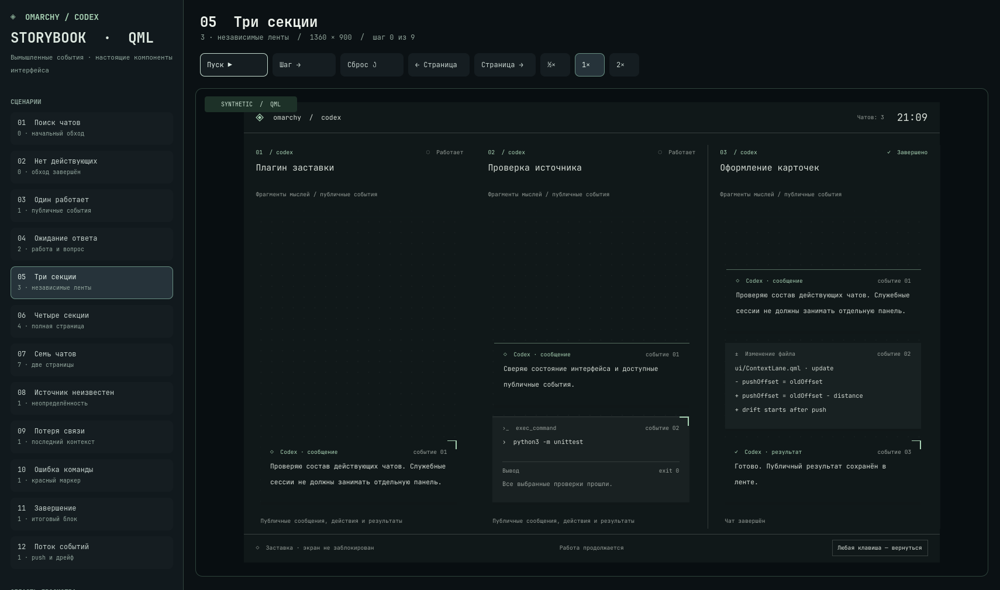

# Endless Session

Живая лента действующих локальных чатов Codex на заставке и экране блокировки Omarchy. Публичные сообщения, команды, изменения файлов и результаты поднимаются снизу вверх; новые события быстро сдвигают старые блоки, после чего лента медленно дрейфует. Несколько чатов получают отдельные секции. Цвета подстраиваются под текущую тему Omarchy.

*Снимок сделан в Storybook на вымышленных данных. Левая панель принадлежит галерее; установленный экран показывает только ленту.*

> **Preview.** Проверена локальная сборка для Omarchy 4.0.4-1, Quickshell 0.3.1 и Qt 6.11.2 с закреплёнными SHA lock/idle. Сон и несколько физических мониторов ещё не проверены. Полный публичный контекст на блокировке виден людям рядом с компьютером.

## Быстрый старт

Установка использует один репозиторий и одну команду установщика **двух** пользовательских service-плагинов. Штатная команда omarchy plugin add URL эту пару на поддержанной версии не устанавливает.

    git clone https://github.com/Lainterus1/Endless-Session.git
    cd Endless-Session
    python3 endless_session.py install

Перед изменением конфигурации установщик проверяет версию Omarchy, Quickshell и Qt, SHA исходных файлов, разблокированное состояние и отсутствие другого lock/idle-клона. Он собирает пакет, сохраняет прежние байты и права пользовательского shell.json, включает lainterus.endless-session и lainterus.endless-session-bridge, перезапускает shell и подтверждает работающую редакцию обоих сервисов и PAM. Результат команды содержит путь backup.

Для возврата к исходному состоянию **после разблокировки**:

    python3 endless_session.py restore --backup ПУТЬ_ИЗ_ВЫВОДА_УСТАНОВКИ

При несовместимых исходниках установка остановится до изменения конфигурации. Не обходите эту проверку.

### Переход с прежнего Codex Idle

Для ранее установленной пары lainterus.codex-idle / lainterus.codex-idle-bridge есть отдельная команда. Перед запуском разблокируйте экран и возьмите путь к **backup этой установленной пары** из прежнего результата установки.

    python3 endless_session.py migrate --legacy-backup ПУТЬ_К_СТАРОМУ_BACKUP

Миграция сначала проверяет старую пару и конфигурацию, восстанавливает штатные сервисы, затем устанавливает новые. Результат содержит migration_record; он нужен для возврата к прежней паре:

    python3 endless_session.py restore-migration --record ПУТЬ_ИЗ_ВЫВОДА_МИГРАЦИИ

При сбое запись фаз остаётся в закрытом пользовательском каталоге состояния; команду возврата можно повторить. Изменения панели и других несвязанных полей переходят в новую конфигурацию; при возврате исходные байты и права восстанавливаются точно. Изменение полей управления плагинами (plugins, disabledPlugins, cloneSourceRestores) или файлов старой пары вызывает отказ до записи. Для обновления текущей версии сначала выполните restore по её backup, затем новый install; обновление поверх активной пары пока не поддерживается.

## Как это работает

- Сканер читает локальные метаданные и журналы Codex только для действующих или ожидающих ответа пользовательских чатов. Служебный guardian исключается до чтения его журнала; завершённые исторические чаты не создают отдельные панели.
- До блокировки заставка закрывается по активности без пароля. После перехода в защищённую блокировку действует штатный WlSessionLock и PAM Omarchy. Отрисовка ленты не принимает решение о доступе.
- Пока чаты работают или ждут ответа, дисплей остаётся включённым. Подтверждённое завершение всех чатов позволяет штатное гашение; при потере связи ошибка остаётся видимой, а удержание снимается через пять минут.
- Публичные тексты обрабатываются локально в памяти. Установщик не меняет настройки Codex и не отправляет содержимое чатов в сеть. Не публикуйте собственные снимки экрана без проверки текста на них.

Источник Codex проверен для локального формата CLI 0.159.2; это не обещание совместимости с будущими версиями. Смена версий Omarchy или содержимого штатных lock/idle-файлов требует новой проверки и пакета.

## Просмотр интерфейса и разработка

[QML Storybook](docs/STORYBOOK.md) показывает настоящие компоненты заставки на явно вымышленных данных:

    qs -p storybook.qml

Применимые локальные проверки:

    python3 -m unittest discover -p 'test_*.py'
    python3 check_storybook.py --out /tmp/endless-session-storybook-check
    python3 check_native_compile.py --out /tmp/endless-session-native-check

Storybook не запускает блокировку, не читает реальные чаты и не проверяет пароль. Проверки файловых транзакций идут в изолированном HOME; работу на физическом экране нужно оценивать отдельно. Исходный код установщика и точные [ограничения совместимости](lock-compatibility.json) можно проверить до установки.

Код распространяется под [MIT](LICENSE). [NOTICE](NOTICE.md) объясняет происхождение частей Omarchy, которые попадают в собранную пару.
