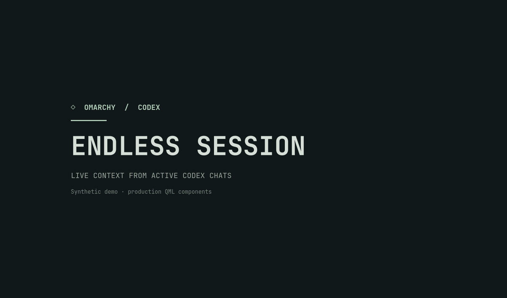

# Endless Session

**A live Omarchy screensaver and lock-screen feed for active local Codex chats.** User-visible messages, commands, file changes, questions, and results rise through each session. New events push older cards upward; the feed then drifts gently. Multiple chats get separate lanes, and the colors follow your Omarchy theme.



*A 10.5-second synthetic demo rendered with the production QML components. It reads no real chats and does not lock the desktop. Promo labels are English; installed interface labels are currently Russian.*

> **Preview:** Tested on Omarchy 4.0.4-1, Quickshell 0.3.1, Qt 6.11.2, and the local Codex CLI 0.159.2 format. The lock and password path was checked on a real desktop. Automatic idle timing, sleep/wake, and multiple physical monitors still need more use and testing. The lock screen shows full user-visible context to anyone near the display.

## Install

One repository and one installer command set up the **two** Omarchy service plugins that Endless Session needs. On the tested Omarchy version, `omarchy plugin add` cannot install this pair from one URL.

```bash
git clone https://github.com/Lainterus1/Endless-Session.git
cd Endless-Session
python3 endless_session.py install
```

Run the installer while the desktop is unlocked. Before changing your configuration, it checks the Omarchy, Quickshell, and Qt versions; pinned Omarchy source hashes; and conflicts with existing lock/idle plugins. It builds and validates both services, saves the exact bytes and permissions of `shell.json`, enables `lainterus.endless-session` and `lainterus.endless-session-bridge`, restarts the shell, and checks both running services and PAM. The command prints the backup path.

To restore the previous configuration, unlock the desktop first and use that path:

```bash
python3 endless_session.py restore --backup /path/from/install-output
```

An unsupported version or changed pinned source stops the installation before it writes to your configuration. Do not bypass that check.

### Migrating from Codex Idle

If the older `lainterus.codex-idle` / `lainterus.codex-idle-bridge` pair is installed, unlock the desktop and supply **the backup path from that installation**:

```bash
python3 endless_session.py migrate --legacy-backup /path/to/old-backup
```

Migration checks the old pair, restores the stock services, and installs Endless Session. It prints a `migration_record` path for returning to the old pair:

```bash
python3 endless_session.py restore-migration --record /path/from/migration-output
```

The migration is resumable after an interruption. Unrelated panel settings are carried forward, while changes to plugin-control fields or the old plugin files cause a safe stop before writing. To update a currently installed Endless Session version, restore its backup and then run the new installer; in-place upgrades are not supported yet.

## Behavior and privacy

| State | What happens |
| --- | --- |
| A chat is working or waiting for your reply | Its user-visible events stay in the feed; the display remains on. |
| All tracked chats finish | The normal display timeout can turn the screen off. |
| A source becomes unavailable | The feed shows the loss of connection; the display hold ends after five minutes. |

Before lock, activity dismisses the screensaver without a password. After lock, Omarchy's WlSessionLock and PAM protect the desktop; the feed does not decide who may unlock it.

The reader tracks active or reply-waiting **local** chats and excludes the internal guardian before opening its journal. Finished historical chats do not get a lane. It renders allowed user-visible events, not private model reasoning, system/developer messages, or arbitrary raw tool output. This plugin processes chat content locally in memory; its installer does not change Codex settings or send chat content to a network service. Check your own screenshots before sharing them.

Compatibility is pinned to the tested source versions and hashes. A future Omarchy or Codex update may require a new compatibility check and plugin build.

## Storybook and development

[QML Storybook](docs/STORYBOOK.md) exercises the real feed components with fictional chats, states, themes, and viewport sizes:

```bash
qs -p storybook.qml
```

Run the relevant local checks from the repository root:

```bash
python3 -m unittest discover -p 'test_*.py'
python3 check_storybook.py --out /tmp/endless-session-storybook-check
python3 check_native_compile.py --out /tmp/endless-session-native-check
```

Storybook and the promo never run PAM or a real system lock. Installer tests use an isolated HOME; they do not replace an on-screen check. Review the [pinned lock compatibility](lock-compatibility.json) and installer source before installing.

## License

Endless Session is available under the [MIT License](LICENSE). [NOTICE](NOTICE.md) records the origin and copyright notice for the Omarchy code included in the generated plugins.
